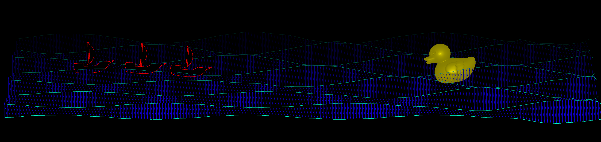

# Moby Duck: An Abstract Audio Visualiser

Video Demonstration:

[](https://youtu.be/COJVn6kwEO0)

## Playback Instructions
- To start the visual demonstration: press the spacebar (space key) once
- To restart: press the spacebar again

*The scenes automatically changes during playback (see 'How It Works')*

## Project Members
- C21376161 Dmytro Kosynskyy
- C21344786 Shawn Lorenzo
- C21518659 Norbert Krupa
- C21427252 Darren Grants
- C21321073 Domas Mockus

# Description Of The Project

## Project Brief
- Create an abstract visual representation of a song of your choosing
- Visualise using Java Processing, Minim and/or Processing Sound libraries
- It should represent the chosen song's theme, narrative, mood, tempo and/or structure
- Showcase teamwork, creativity, technical skills and communication through tools such as GitHub for project management

## The Song: Moby Duck (The Longest Johns)

[](https://youtu.be/xA7e_dxDOCo)

## Visual Representations

### Dmytro




### Shawn


Taking inspiration from the general nautical theme of the song, I created a visual that represents how sailors would get their data on the high seas. It features 4 distinct elements:

- A background chart 'surface' to put the visual displays on
- A sonar wave with tuned amplitudes to cover certain frequency ranges
- A radar screen with an estimated location of ducks from the sonar
- A radio transmission set to check how the sailor's communications are holding

While the current positions of the displays are fixed for the project, they could be rearranged in any alignment through code similar to this:
'''
sonar1.screen(shapeW, (shapeH/2)-(shapeH/3), shapeW/2.5f, shapeH/6, 7, "Broadband Sonar", shapeH/42, "Hz", 0);

'''

### Norbert


### Darren


### Domas


# How It Works

## File Structure

## Audio-To-Visual Analysis

## Playback Control

# What We Are Most Proud Of

### Dmytro
### Shawn
### Norbert
### Darren
### Domas

# Markdown Tutorial

This is *emphasis*

This is a bulleted list

- Item
- Item

This is a numbered list

1. Item
1. Item

This is a [hyperlink](http://bryanduggan.org)

# Headings
## Headings
#### Headings
##### Headings

This is code:

```Java
public void render()
{
	ui.noFill();
	ui.stroke(255);
	ui.rect(x, y, width, height);
	ui.textAlign(PApplet.CENTER, PApplet.CENTER);
	ui.text(text, x + width * 0.5f, y + height * 0.5f);
}
```

So is this without specifying the language:

```
public void render()
{
	ui.noFill();
	ui.stroke(255);
	ui.rect(x, y, width, height);
	ui.textAlign(PApplet.CENTER, PApplet.CENTER);
	ui.text(text, x + width * 0.5f, y + height * 0.5f);
}
```

This is an image using a relative URL:


This is an image using an absolute URL:


This is a youtube video:

[](https://www.youtube.com/watch?v=J2kHSSFA4NU)

This is a table:

| Heading 1 | Heading 2 |
|-----------|-----------|
|Some stuff | Some more stuff in this column |
|Some stuff | Some more stuff in this column |
|Some stuff | Some more stuff in this column |
|Some stuff | Some more stuff in this column |
