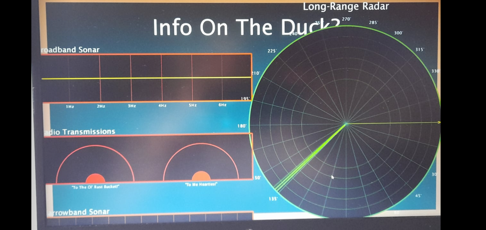

# Moby Duck: An Abstract Audio Visualiser

Video Demonstration:

[](https://youtu.be/COJVn6kwEO0)

## Playback Instructions
- To start the visual demonstration: press the spacebar (space key) once
- To restart: press the spacebar again

*The scenes automatically change during playback (see 'How It Works - Playback Control')*

## Project Members
- C21376161 Dmytro Kosynskyy [@DimaKosy](https://github.com/DimaKosy)
- C21344786 Shawn Lorenzo [@ByteFlypVS](https://github.com/ByteFlypVS)
- C21518659 Norbert Krupa [@Voirtez](https://github.com/Voirtez)
- C21427252 Darren Grants [@darrenomight](https://github.com/darrenomight)
- C21321073 Domas Mockus [@Orbdom](https://github.com/Orbdom)

# Description Of The Project

## Project Brief
- Create an abstract visual representation of a song of your choosing
- Visualise using Java Processing, Minim and/or Processing Sound libraries
- It should represent the chosen song's theme, narrative, mood, tempo and/or structure
- Showcase teamwork, creativity, technical skills and communication through tools such as GitHub for project management

## The Song: Moby Duck (The Longest Johns)

[](https://youtu.be/xA7e_dxDOCo)

While Dmytro was searching for a song for our project, he got confronted by a flock of ducks. They wouldn't scatter quickly enough so he apparently waved his foot across them and scared them off his path!
Then he had an idea...

Sea shanties were always cool to him and one of the most memorable ones when he saw those ducks was this hit by The Longest Johns. It depicts a long-retired sailor, whose solitude was interrupted by a mythical, giant duck on his lake. He then goes to settle the score with the duck with the help of his ol' mates, and after a long, well-fought battle, they celebrated with a banquet of BBQed duck, pancakes and oyster sauce!

When he gave the piece to the team, we thought it was funny and would be a fun theme to explore; from ducks to ships to waves and even obscure nautical references! It was light-hearted and fast-paced, and honestly we agreed to use it as everyone else had no idea what song to choose at the time... Oh well!

## Visual Representations

### Dmytro: Ducks, Ships And Waves


I made two visuals for this project; one is a simple circle of rotating ducks which respond to the audio frequency bands. It is based off the cubes example shown in class.

```Java
for(int i = 0; i < DuckScaler.length; i++) {
		DuckScaler[i] = PApplet.map(mv.getSmoothedBands()[i],0,200,0.5f,3);
}
```


The second visual creates an array of points. These points go from right to left at a set pace, their height is set by the average frequency bands value which is then multiplied by a sin() function and lerped.

```Java
float BufferAvg() {
	float Avg;
	Avg = 0;
	for(int i = 0 ; i < mv.getBands().length ; i ++) {
		Avg += mv.getSmoothedBands()[i];
	}

	return (Avg/mv.getBands().length) *  0.3f;
}
```

```Java
if(p2 < p1) {
	points[(i + ((Move < 0)?0:1))%AmtPoints] = PApplet.lerp(points[(i + ((Move < 0)?1:0))%AmtPoints],(float)Math.sin(i*0.1)*ToLerp,0.5f);
	continue;
}
```

Each point is joined to the next point to make a wave like so:
```Java
mv.line(p1, points[i] + WaveHeight, p2, points[(i+1)%AmtPoints] + WaveHeight);
```
...which allows us to render a single wave.

By rendering multiple waves we can also call on the JoinWaveVerts() function.
This function joines the vertices of the waves so as to create triangles between them.

```Java
void JoinWaveVerts(Wave w1) {
	if(w1 == null) {
		return;
	}

	for(int i = 0; i < w1.AmtPoints; i++) {

		float p1 = ((float)(i)/AmtPoints)*WaveWidth;
		float p2 = (i < w1.AmtPoints)?(((float)(i+1)/AmtPoints)*WaveWidth):(p1);

		mv.line(p1, GrabWavePoint(p1), p1, w1.GrabWavePoint(p1));
		mv.line(p1, GrabWavePoint(p1)+2, p2, w1.GrabWavePoint(p2)-2);
	}
}
```

As the boats need to know what vertex to "float" on I had to create a function to find the poet that is currently at a specific X position on the screen
```Java
public float GrabWavePoint(float pos){
        //WaveWidth * (WaveOffset/(float)WaveWidth) + WaveWidth;
        //p1 = (offset + (i/AmtPoints)*WaveWidth) % WaveWidth
        return points[((int)PApplet.round((float) AmtPoints * ( ((pos - WaveOffset + WaveWidth))%WaveWidth / WaveWidth))) % AmtPoints] + WaveHeight;
    }
```

### Shawn: What's Out There?


Taking inspiration from the general nautical theme of the song, I created a visual that represents how sailors would get their data on the high seas. It features 4 distinct elements:

- A background chart 'surface' to put the visual displays on
- A sonar wave with tuned amplitudes to cover certain frequency ranges
- A radar screen with an estimated location of ducks from the sonar
- A radio transmission set to check how the sailor's communications are holding

Audio data was being processed through the MyVisual/Visual class, which uses the Java Minim audio processing library. This was then modified to create certain wave amplitude behaviour for the sonar, such as:

``` Java
// Wave visualisation method (with scaling/lerp functions)
public void modWave(float scale)
{
	mv.pushStyle();
	mv.beginShape();

	for(int i = 0; i < mv.getAudioBuffer().size(); i++)
	{
		waveX = MyVisual.map(i, 0, mv.getAudioBuffer().size(), topX, topX+shapeW);
		waveY = MyVisual.map(mv.getAudioBuffer().get(i), -1, 1, -scale*shapeH, scale*shapeH);
		waveY = MyVisual.lerp(topY+shapeH/2, topY+shapeH/2+waveY, scale);
		waveY = MyVisual.constrain(waveY, topY, topY+shapeH);

		mv.smooth();
		mv.noFill();
		mv.stroke(255, 255, 0); // Change colour here
		mv.strokeWeight(4);
		mv.curveVertex(waveX, waveY);
	}

	mv.endShape();
	mv.popStyle();
}
```

...where 'scale' is a scaling factored applied to the lerped y-values for the AudioBuffer.

To create an animation for a scanning line for the radar, it involved passing in a frameCount value from MyVisual to constantly generate it while the visual is shown:

``` Java
// Radar scanning method
public void scan(float frame, float speed)
{
	scanX = shapeX+(shapeR/2)*MyVisual.cos(MyVisual.radians(frame*speed));
	scanY = shapeY+(shapeR/2)*MyVisual.sin(MyVisual.radians(frame*speed));

	mv.stroke(0, 255, 0); // Change colour here
	mv.strokeWeight(6);
	mv.line(shapeX, shapeY, scanX, scanY);
}
```

However, this meant that when testing for a RadarContact class (not included in the final code), it kept generating a single contact every frame with or without the line (which had intersect detection) touching it. Proving to be a debugging nightmare, it was replaced by a compass arrow that indicates the suspected direction of the duck.

While the current positions of the displays are fixed for the project, they could be rearranged in any alignment through code similar to this:

``` Java
sonar1.screen(shapeW, (shapeH/2)-(shapeH/3), shapeW/2.5f, shapeH/6, 7, "Broadband Sonar", shapeH/42, "Hz", 0);
```

...where the final parameter '0' indicates that the display should be left-centre aligned to the chart.

It should be noted that the sailor from the song was likely from the 1800's, so he probably didn't have access to these tools to find pirates, let alone a giant duck!

For me, I was proud that all the elements are working as intended; this is given the fact that there were a total of 7 elements reacting to either the audio or the display frame rate. I felt satisfaction when the radar screen was first implemented and saw that line rotate without any traces from my experimentation with it. It was unfortunate that a radar contact could not be implemented, but it is an improvement that could be later explored in a code refactor.

Through working with this visual, I further understood the heirarchies that exist in Object-Oriented Programming, how different classes interact with each other to perform tasks and learned a thing or two on how to design a visual that can scale to different screens (Dmytro can fill in the details when first merging my visual to the master branch!)



### Norbert: Lively Lyrics


My visual is a wave of lyrics that changes height with the amplitude of the song. To make this, I used three classes:

#### Norbert
- Primary drawing class
- Handles all logic in this visual

#### Character
- Stores the display character as a char data type
- Also stores the x and y values as floats

``` Java
public class Character
{
    MyVisual mv;
    char c;
    float x;
    float y;

    public Character(MyVisual mv, char c, float x, float y)
    {
        this.mv = mv;
        this.c = c;
        this.x = x;
        this.y = y;

    }
}
```

#### LyricLine
- Stores lyric line as an array list of Character objects
- Also stores the timestamp for the song

``` Java
public class LyricLine
{
    MyVisual mv;
    ArrayList<Character> line = new ArrayList<Character>();
    int timestamp;

    public LyricLine(MyVisual mv, ArrayList<Character> line, int timestamp)
    {
        this.mv = mv;
        this.line = line;
        this.timestamp = timestamp;
    }
}
```

I created an array list of LyricLine objects in the Norbert class. I then parsed the lyrics as a text file in the format <timestamp in milliseconds> <lyric> split this into two parts.
I stored the timestamps into the timestamp variables in the LyricLine objects. Then I split the line of lyrics into individual characters and stored the characters into the array list of Character objects in the LyricLine object.

``` Java
for(int i = 0; i < lines.length; i++)
{
	String[] words = PApplet.split(lines[i], " ");
      	int timestamp = Integer.parseInt(words[0]);

      	ArrayList<Character> line = new ArrayList<Character>();

      	for(int j = 1; j < words.length; j++)
       	{
       		String word = words[j];

              	for(int k = 0; k < word.length(); k++)
                {
                	char c = word.charAt(k);
                    	line.add(new Character(mv, c, mv.width + mv.textWidth(c ), mv.height / 2)); 
                }

               	line.add(new Character(mv, ' ', mv.width, mv.height / 2));
    	}

     	lyrics.add(new LyricLine(mv, line, timestamp));
}
```

I then use an if statement to check the position of the audio player. If the position of the player is equal to the timestamp, the corresponding line of lyrics is displayed on the right side of the screen.
The lyric line is displayed character by character using the text() function adding sin(radians(x) * amplitude to the y. The wave is multiplied by the amplitude to get the desired effect of the height of the wave changing.

I also added an offset to the x of every character after the first. This is done by using an if statement to check if the index is greater than 0. If this is the case I assign current x to be the previous x plus the width of the previous character.
Right before the text is displayed, I decrement the x by 6.0f so that the line of lyrics scrolls towards the left of the screen.

``` Java
for(int i = 0; i < lyrics.size(); i++)
{
	LyricLine lyricLine = lyrics.get(i);

	if(mv.getAudioPlayer().position() >= lyricLine.timestamp)
	{
		amp = mv.getSmoothedAmplitude() * 300;
            
		for(int j = 0; j < lyricLine.line.size(); j++)
		{
			Character c = lyricLine.line.get(j);
                    
			if(j > 0)
			{	
				Character prev = lyricLine.line.get(j - 1);
				c.x = prev.x + mv.textWidth(prev.c) * 1.3f;
			}
                    
			c.x -= 6.0f;
			mv.fill(255);
			mv.textSize(32);
			mv.text(c.c, c.x, c.y + PApplet.sin(PApplet.radians(c.x)) * amp);

		}
	}
}
```
If I had to choose one thing in my visual that I'm most proud of, it would have to be that I got the class structure working exactly the way I envisioned it without having to make any compromises or massive changes.

Throughout the project, I learned how to parse files (in Java), manipulate strings, work with array lists, create efficient class structures in an object oriented manner, sync visuals with audio and make audio control visuals.
	
### Darren: Growing Bubbles


For my visual, I wanted to create a scene where bubbles would spawn from the edges of the screen. They would then bounce around the screen while a 3D wave inspired from my labwork would interact with these and the music.

In order to create the bubbles, I defined a Bubble class that represents one bubble and a Bubbles class that creates an array of them. Then, I set a random x and y vector position for each bubble when the visual loads, as well as which side of the display they will spawn from.

``` Java
// Initalsing bubble array
bob = new bubble[size];

// This for loop deides on which side of the screen the bubble will spawn by dividing the array size by modulos of 4 
for(int i = 0; i < size; i++)
{
	float x = 0, y = 0; 
	switch (i%4) 
	{
		case 0:
		//left
			x = p.random(0,width);
			y = p.random(0, height);
			break;
		case 1:
		//right
			x = p.random(0,width);
			y = p.random(0, height);

			break;
		case 2:
		//bottom
			x = p.random(0, width);
			y = p.random(0,height);
			break;
		case 3:
		//top
			x = p.random(0, width);
			y = p.random(0, height);

			break;
				
	
		default:
			break;
	}
		
	pos = new PVector(x,y);
	bob[i] = new bubble(pos,p);
}
```

I added certain mechanics when the bubbles touch the screen border. First, it would reduce the bubble's health by 1 in order to 'pop' after a set amount of screen bounces and set the movement speed of the bubbles

``` Java
public void update()
{
	// This set of If statements prevents the balls from leaving the screen border 
	// Change DIRX *= 1.15 1.05 1.5 1.25 these all either slow it down or speed it up 
	
	if(pos.x > p.width)
	{
		DirX *= -1.1;
		lives--; 
	}
	
	if(pos.x < 0) 
	{
		DirX *= -1.1;
		lives--;
	}

	if(pos.y > p.height)
	{
		DirY *= -1.1;
		lives--;
	}
	
	if(pos.y < 0) 
	{
		DirY *= -1.1;
		lives--;
	}

	pos.x += DirX;
	pos.y += DirY;
	
	if (lives > 0)
	{
		Tail();
		
	}
	lives = 10;
}
```

After a set amount of bounces, a tail would start to grow behind the bubble. This pattern of movement will continue while the visual is shown onto the display.

``` Java
// grows the tail of the circles after the bounce enough times
public void Tail() 
{
	//if a bubbles life = > 3 leave an explosion at current location
	p.rect(pos.x, pos.y, DirX, DirY);
	lives = 10;
}
```

For the 3D wave, I lerped the coordinates of a set of rectangles by the AudioBuffer size from the audio file. By doing this, it creates an illusion of an oblique wave responsing to the wave, which I thought was cool!

``` Java
public void render() 
{
	vis.colorMode(PApplet.HSB);
	for (int i = 0; i < vis.getAudioBuffer().size(); i++) {
		// setting the stroke to the rectangle using map
		vis.stroke(
				PApplet.map(i, 0, vis.getAudioBuffer().size(), 0, 255), 255, 255);

		// Setting the lurp variables
		lerpedBuffer[i] = vis.lerp(lerpedBuffer[i], 350 * vis.getAudioBuffer().get(i), 0.12f);

		vis.fill(
				PApplet.map(i, 0, vis.getAudioBuffer().size(), 0, 255), 215, 255

		);
		vis.rect(width * ((float) i / (float) vis.getAudioBuffer().size()), cy - lerpedBuffer[i],
				90 * width / vis.getAudioBuffer().size(), lerpedBuffer[i]);
		
		// Comment out the below to get rif of 
		vis.rect(halfW - lerpedBuffer[i]/2, halfH, lerpedBuffer[i],height );

	}
}
```

Overall, I was very proud of my bubbles. I enjoyed working on them as I got to understand movement mechanics for an object. I was also proud of the bubble's tail, as they were originally meant to be explosive bubbles; however I liked the growing effect a bit more than an explosion! I could've improved the bounce movement of the bubbles from the current implementation by increasing the DIRX value to say, 1.15 for the video. The 3D wave was also cool to see as opposed to a more normal wave.

Neat things I learned doing this visual are the use of subclasses, the use of arrays to store more than one instance of an object and experimenting with vector movement.

### Domas: Acoustic Bars


My visual involved creating a set of separated column bars that rise or lower depending on the amplitude of the music.

For this, I extensively used the floor method to figure out how many squares in the separated column can fit to the screen size overall and how many are needed to fill to a certain amplitude.

``` Java
// Calculate the number of squares that can fit in the window
int numSquares = PApplet.floor((mv.height - verticalGapSize) / (squareSize + verticalGapSize));

// Calculate the number of squares in the column
int squaresInColumn = PApplet.floor(numSquares * (smoothedAmplitude * 2 + mv.random(-0.02f, 0.02f)));
```

I then used the methods from MyVisual to create a class copy of the audio data as I was more familiar with this technique that referencing from MyVisual. I also smoothed the amplitude readings to make the visual less jarring to watch.

``` Java
// Get the current sound data
float[] samples = ab.toArray();

// Calculate the amplitude of the current buffer
amplitude = 0;
for (int i = 0; i < samples.length; i++) {
	amplitude += samples[i] * samples[i];
}
amplitude = PApplet.sqrt(amplitude / samples.length);

// Interpolate between the previous amplitude and the current amplitude
smoothedAmplitude = PApplet.lerp(smoothedAmplitude, amplitude, 0.6f);
```

Finally, I used these combined information to create a set of bar columns depending on how many I wanted on the screen when my visual runs.

``` Java
for (int i = 0; i < numColumns; i++) {
	// Calculate the number of squares in the column
	int squaresInColumn = PApplet.floor(numSquares * (smoothedAmplitude * 2 + mv.random(-0.02f, 0.02f)));

	// Draw the squares
	float y = mv.height - verticalGapSize;
	int squareCounter = 0;
	while (squareCounter < squaresInColumn) {
		// Calculate the color based on the height
		float c = PApplet.map(y, 0, mv.height, 0, 255);
		mv.fill(c, 200, 200);
		mv.rect(x, y - squareSize, columnWidth, squareSize);
		squareCounter++;
		y -= (squareSize + verticalGapSize);
	}

	// Move to the next column
	x += columnWidth + horizontalGapSize;
}
```

Overall, the thing I was most proud of is the way the individual squares stack up against one another within the column. I could've made it more complex by trying to reference MyVisual more instead of passing local instances of PApplet or Minim in several occassions; but that's part of the learning process!

# How It Works

## File Structure And Class Formats
Each member created a package for themselves, inside of which we had our own code. It consists of a main drawing class (files named after ourselves) that then calls the other objects inside their package.


Each person's code is ran through some sort of 'visual' function in their main drawing class. This allows for reading consistency in our code. We are also using the functions that were already implemented from the Visual class and building on top of them.

``` Java
// Example visual() method from Shawn's visualiser
public void visual()
{
	// Gap between the screen edge and chart edge (inset)
	shapeG = 30;

	// Set chart size for objects
	shapeW = board1.getWidth()-shapeG;
	shapeH = board1.getHeight()-shapeG;

	// Create chart
	board1.screen(shapeG, 20, "Info On The Duck?", shapeH/16);
	
	// Create top sonar screen
	sonar1.modWave(0.35f);
	sonar1.screen(shapeW, (shapeH/2)-(shapeH/3), shapeW/2.5f, shapeH/6, 7, "Broadband Sonar", shapeH/42, "Hz", 0);

	// Create bottom sonar screen
	sonar2.rawWave();
	sonar2.modWave(1.25f);
	sonar2.screen(shapeW, (shapeH/2)+(shapeH/5), shapeW/2.5f, shapeH/6, 13, "Narrowband Sonar", shapeH/42, "KHz", 0);

	// Create middle radio box
	gauge1.screen(shapeW, (shapeH/2)-(shapeH/16), shapeW/2.5f, shapeH/6, "Radio Transmissions", shapeH/42, 0);
	gauge1.scan(mv.frameCount, mv.getAmplitude()/16, 0);
	gauge1.scanScreen("\"To The Ol' Rust Bucket!\"", shapeH/8, 0);
	gauge1.scan(mv.frameCount, mv.getSmoothedAmplitude()/10, 1);
	gauge1.scanScreen("\"To Me Hearties!\"", shapeH/8, 1);

	// Create radar screen
	radar1.project(mv.frameCount, mv.getSmoothedAmplitude()/4);
	radar1.scan(mv.frameCount, 1.5f);
	radar1.screen(shapeW, shapeH*11/20, shapeH/1.55f, 6, 24, "Long-Range Radar", shapeH/36, 2);
}
```

All our code ran through the MyVisual class that was provided with the skeleton code as follows:

``` Java
// Import statements to each of the project members
import ie.tudublin.*;
import c21376161.*;
import c21321073.DM_Project2;
import c21344786.*;
import c21518659.*;
import c21427252.*;

// Create an instance of their main drawing class and initialise them with the instance for MyVisual
Dima dima;
Norbert norbert;
Shawn shawn;
Darren darren;
DM_Project2 domas;

dima = new Dima(this);
norbert = new Norbert(this);
dima = new Dima(this);
shawn = new Shawn(this);
darren = new Darren(this);
domas = new DM_Project2(this);
```

## Playback Control

We decided early on that the visual shown should automatically change depending on what percentage has the song been completed. To do this, Dmytro mapped the Visual's position parameter and translated the total length of the song into a precentage count. Then, he used if statements to determine the position each visual would display. We tried getting it close to the chorus-verse transitions, but it was a bit of a hassle to accurately determine them!

``` Java
// Map the song length to a percentage
position = map(getAudioPlayer().position(), 0, getAudioPlayer().length(), 0, 100);

// Display visuals when the song reaches the position percentage
if(position <= 20) {
	background(0);
	norbert.visual();   
}

if(position >= 20 && position <= 30) {
	dima.Visual(2);
}

if(position >= 30 && position <= 40) {    
	dima.Visual(0); 
}

if(position >= 40 && position <= 60) {
	colorMode(RGB);
	shawn.visual();
}

if(position >= 60 && position <= 80) {
	float r;
	r = random(20, 50);
	fill(0,0,0,r);
	rect(0, 0, width, height);
	darren.render();
}

if(position >= 80 && position <= 100) {
	domas.visual();
}
```

## List Of Classes/Assets Used

| Class/Asset| Source |
|-----------|-----------|
| MyVisual | Provided skeleton - main calling/execution class |
| Dima | Self written - main drawing class |
| Bobber | Self written |
| Boat| Self written |
| DuckCircle | Self written |
| DuckVortex | Self written |
|SuperDuck | Self written |
| Wave| Self written |
| Norbert | Self written - main drawing class |
| LyricLine| Self written |
| Character| Self written |
| Darren| Self written - main drawing class |
| bubble| Self written |
| bubbles| Self written |
| crosswave| Self written |
| Shawn| Self written - main drawing class |
| Sonar| Self written |
| Rader| Self written |
| Gauge| Self written |
| Board| Self written |
| DM_Project2| Self written - main drawing class |
| MobyDuck.mp3/wav| [YouTube](https://www.youtube.com/watch?v=xA7e_dxDOCo&ab_channel=TheLongestJohns) |
| MobyDuck.txt| [Online](https://genius.com/The-longest-johns-moby-duck-lyrics) |
| duck.obj| [Online](https://free3d.com/3d-model/rubber-duck-v1--614347.html) |